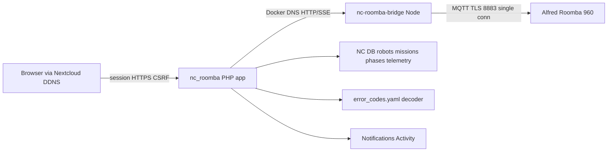

# NC-Roomba v0.1.0 — checked-in plan

# NC-Roomba v0.1 — Alfred control app

## Locked decisions

- **Repo path:** [`/media/4TB/nc-roomba`](/media/4TB/nc-roomba) (sibling of [`/media/4TB/nc-print`](/media/4TB/nc-print); path is free today)
- **App id / namespace / display:** `nc_roomba` / `OCA\NcRoomba` / **NC Roomba**
- **GitHub:** public `vdroners/nc-roomba` (create + push only after operator approval)
- **License:** AGPL-3.0-or-later (match nc-print); bridge deps MIT (`dorita980`)
- **Target platform:** Nextcloud **33.0.3**, PHP **8.4**, deploy into `cloud_app` at `/var/www/html/custom_apps/nc_roomba`
- **Robot:** Alfred, Roomba 960; local MQTT/TLS only; no iRobot cloud after onboarding
- **Auth:** Nextcloud admins configure; `roomba-operators` group may control
- **History:** accumulate locally from install; retention admin-configurable (default 365 days)
- **Location UI:** capability-detect pose → live map; else honest last-known / phase fallback + optional floorplan
- **Controls:** supported commands only — clean / spot / pause / resume / stop / dock / find
- **Notifications:** Nextcloud Notifications + Activity only
- **Skeleton source:** clone layout/workflow from nc-print; vendor selected NC-GCS patterns (theme tokens, secret crypto, group gate, proxy+SSE) with **no hard dependency** on `nc_gcs`
- **GUI package:** all eight operator-GUI additions below are in v0.1 (not deferred)

## Architecture



- Browser never talks to Alfred or the bridge directly.
- Bridge binds only on Docker network (not public); PHP proxies all actions/state.
- Bridge owns the single MQTT connection; PHP persists telemetry/history and enforces ACL.
- Bridge emits a **normalized state DTO**; PHP enriches with `decoded_error` + `connection_health` for the GUI.

## Normalized state DTO (single source for GUI)

Bridge → PHP → Pinia `robot` store. Every GUI surface reads this shape (fields may be null when unsupported):

```json
{
  "robot_id": 1,
  "name": "Alfred",
  "connected": true,
  "conflict": null,
  "updated_at": "ISO-8601",
  "battery_pct": 86,
  "bin": "ok|full|missing|unknown",
  "rssi": -52,
  "phase": "charge|run|hmPostMsn|stop|…",
  "cycle": "none|clean|spot|…",
  "error": 0,
  "not_ready": 0,
  "has_pose": false,
  "pose": { "x": null, "y": null, "theta": null },
  "mission": { "started_at": null, "sqft": null, "mssn_m": null },
  "bbrun": {},
  "bbmssn": {},
  "bridge": { "version": "0.1.0", "uptime_s": 0 }
}
```

PHP adds:

```json
{
  "decoded_error": { "code": 0, "title": "", "detail": "", "action": "" },
  "connection_health": { "mqtt": "up|down|conflict", "stale": false, "last_command": {} },
  "next_scheduled": { "day": "Mon", "local_time": "15:00", "server_offset_min": 0 }
}
```

## GUI additions — implementation assessment (all in v0.1)

### UI-1 Status strip (sticky header)

**Best approach:** Presentational Vue component `StatusStrip.vue` mounted in `AppShell.vue`, reading Pinia only (no extra API). SSE/poll already updates the store; strip recomputes “last seen” age client-side (`setInterval` 1s for relative text only).

**Why:** Keeps one live pipeline; avoids duplicate polling. Matches NC-GCS “always-on HUD” pattern without Cesium weight.

**Data:** `battery_pct`, `bin`, `rssi`, `phase`, `updated_at`, `connected`, `conflict` (conflict chip opens UI-7 drawer).

### UI-2 Quick actions + confirm for destructive commands

**Best approach:** `ControlPad.vue` with `@nextcloud/vue` `NcButton` + `NcDialog`. Map:

- Immediate (no confirm): clean, spot, pause, resume, dock, find
- Confirm required: **stop**, and any “cancel / end mission” if distinct from pause

POST `/api/robots/{id}/action/{name}` with CSRF; optimistic phase hint; revert on error; always write `command_audit`.

**Why:** Fat-finger protection on mobile; keep low-friction for the common path (pause/dock).

### UI-3 Error decoder panel

**Best approach:** Static catalog `knowledge/error_codes.yaml` (Roomba `error` + `notReady` codes from dorita980/openHAB/HA community), loaded by PHP `ErrorDecoderService`. State API always includes `decoded_error`. UI shows `ErrorDecoderPanel.vue` only when code ≠ 0.

**Why:** Decode once server-side so notifications, Activity, and UI share the same copy. Do not scrape iRobot cloud docs at runtime.

### UI-4 Mission timeline

**Best approach:** New table `mission_phase_events` (`mission_id`, `ts`, `phase`, `cycle`, `source`). Bridge/PHP on each state delta: if phase/cycle changed, append a row. Component `MissionTimeline.vue` renders horizontal bands; used live (current open mission) and in History detail (same component, different props).

**Why:** Timeline is a view over persisted events — no separate live-only format. Survives page refresh mid-mission.

### UI-5 Schedule calendar week view

**Best approach:** `ScheduleWeekGrid.vue` edits the existing dorita980 `setWeek` shape (`cycle[]`, `h[]`, `m[]`, index 0=Sunday). Load via GET schedule; save via POST. Show **next scheduled start** computed in PHP and **robot-local vs NC server timezone** warning (Roomba week times are robot-local; NC server may differ).

**Why:** Operators think in days/times, not arrays. Keep wire format identical to rest980/dorita980 so the bridge stays thin.

### UI-6 Maintenance / wear hints from `bbrun`

**Best approach:** Bridge already exposes `getBbrun` / mission stats. PHP `MaintenanceHintService` applies soft thresholds from `knowledge/maintenance_thresholds.yaml` (e.g. stuck rate vs hours, scrub count). UI `MaintenanceHints.vue` on Dashboard + History — advisory chips only, never blocking fly/clean.

**Why:** Local counters become useful without claiming Smart Map / brush-life cloud features the 960 does not expose locally.

### UI-7 Connection health drawer

**Best approach:** Right-side `NcAppSidebar` / drawer toggled from StatusStrip conflict/connection chip. Payload from enriched `connection_health` + bridge `/health`. Static recovery checklist: close iRobot app, wait 30s, Retry connect, verify DHCP reservation, check `nc -zv IP 8883` from host.

**Why:** Single-connection MQTT is the #1 support footgun; surface it in-product.

### UI-8 Dark/light via Nextcloud theme

**Best approach:** Do **not** ship a custom theme toggle. Vendor NC-GCS CSS variables that already map to Nextcloud `--color-*` / body theme classes. SCSS uses `var(--color-main-background)`, `var(--color-main-text)`, `var(--color-primary-element)`, plus `--nc-app-accent` for brand. Verify both `body.theme--light` and `body.theme--dark` in browser gates.

**Why:** One appearance system with the host Nextcloud UI; zero extra settings surface.

## Reasonable scope expansions (gap-fill vs prior draft)

These stay in v0.1 because they prevent an incomplete “control panel”:

1. **Onboarding wizard** — DHCP reservation guide, LAN discover, hold-HOME BLID/password fetch, connection test.
2. **Capability matrix** — report `has_pose`, schedule, preferences, bin sensor; UI adapts.
3. **Operator command audit log** — who issued clean/pause/dock and when.
4. **Conflict banner** — detect MQTT single-connection refusal (iRobot app open) with recovery steps.
5. **Find / spot** — locate beep + spot clean alongside start/pause/resume/stop/dock.
6. **Optional floorplan upload** — backdrop for pose or last-known marker.
7. **Lifetime stats** — `bbrun` / `bbmssn` cards (hours, area, stuck/scrub counts).
8. **SSE + poll fallback** — live state without requiring notify_push.
9. **Bridge health + reconnect** — `/health`, auto-reconnect, stale-state UI.
10. **Retention prune job** — dry-run admin preview; default 365 days.
11. **CSV/JSON export** — missions + telemetry window.
12. **Short Planning pointer** — one markdown note under Planning linking to `/media/4TB/nc-roomba` (no app code in Planning).
13. **Status strip** — sticky battery/bin/RSSI/phase/last-seen (UI-1).
14. **Destructive-action confirms** — stop / cancel (UI-2).
15. **Error decoder** — plain-English error/notReady panel (UI-3).
16. **Mission timeline** — live + history phase bands (UI-4).
17. **Schedule week grid** — visual `setWeek` editor + timezone note (UI-5).
18. **Maintenance hints** — soft thresholds on `bbrun` (UI-6).
19. **Connection health drawer** — MQTT/conflict/recovery checklist (UI-7).
20. **Inherit NC light/dark theme** — CSS vars only (UI-8).

## Out of scope (v1)

- Manual joystick drive
- iRobot cloud history import / ongoing cloud
- Email notifications
- Multi-robot UI in first ship (schema multi-ready; UI ships Alfred-first)
- Hard dependency on `nc_gcs` / ecosystem sibling registration
- Custom in-app theme picker (use Nextcloud appearance)
- Claiming brush/filter replacement schedules without local sensor data

## Implementation phases

### Phase 0 — Repo bootstrap
- `git init` at `/media/4TB/nc-roomba`, AGPL LICENSE, `.gitignore`, README, `CLAUDE.md`/`AGENTS.md` adapted from nc-print + NC-GCS commit trailer rules
- Checked-in plan: `docs/plans/nc-roomba-v0.1.0.md` (includes this GUI package)
- Planning pointer: `/media/4TB/Planning/nc-roomba.md` (link only)

### Phase 1 — Nextcloud app skeleton
Port from [`/media/4TB/nc-print`](/media/4TB/nc-print): `appinfo/`, `lib/AppInfo/Application.php`, `PageController`, `templates/`, webpack Vue 2.7 + Pinia, Makefile `build` / `bump-*` / `deploy` / `ship` / `gate-*`.
Vendor theme tokens from [`apps/nc_gcs/css/nc-gcs-theme.css`](/media/4TB/nc-gcs/apps/nc_gcs/css/nc-gcs-theme.css) and a thin `AppShell.vue` (StatusStrip slot + router outlet + sidebar slot for Connection drawer). CSP nonce via `@nextcloud/auth` `getCSPNonce()`. Target `info.xml` deps: PHP 8.1–8.4, NC 28–34 (match nc-print).

### Phase 2 — Data model + catalogs
Entities/mappers/migrations: `robots`, `missions`, `mission_phase_events`, `telemetry_samples`, `robot_settings`, `command_audit`, `floorplans`.
Encrypt robot local password with a local copy of [`AdminSecretCrypto`](/media/4TB/nc-gcs/apps/nc_gcs/lib/Service/AdminSecretCrypto.php) pattern (`enc:v1:` + `ICrypto`).
Add `knowledge/error_codes.yaml` + `knowledge/maintenance_thresholds.yaml` and PHP services that consume them.

### Phase 3 — Bridge sidecar
`bridge/` Node Express + `dorita980`, Dockerfile, `docker-compose.bridge.yml`, shared Docker network attached to `cloud_app` (same pattern as nc-print slicer network).
Endpoints: health, discover, onboard/get-password, action/*, state, stream (SSE), preferences, schedule, bbrun.
Owns single MQTT session; capability-detect pose; emit conflict errors; emit **normalized state DTO** (above).

### Phase 4 — PHP API / ACL / proxy
Controllers proxy bridge; CSRF on mutations; `roomba-operators` group gate (vendored from [`NcGcsGroupAccess`](/media/4TB/nc-gcs/apps/nc_gcs/lib/Util/NcGcsGroupAccess.php) idea).
State responses enriched with `decoded_error`, `connection_health`, `next_scheduled`.
Admin settings: robot config, DHCP guidance, operator group, retention days, floorplan upload.
Background jobs: telemetry sample/persist, mission rollup + phase-event append, retention prune, notification fan-out.

### Phase 5 — Vue UI (responsive) — full GUI package

Shell layout:

```text
AppShell
├── StatusStrip (UI-1)          ← sticky
├── RouterView
│   ├── Dashboard
│   │   ├── ControlPad (UI-2) + confirms
│   │   ├── ErrorDecoderPanel (UI-3)
│   │   ├── MissionTimeline live (UI-4)
│   │   └── MaintenanceHints (UI-6)
│   ├── Location (map / fallback / floorplan)
│   ├── History (list/detail + timeline UI-4 + export)
│   └── Settings
│       ├── ScheduleWeekGrid (UI-5)
│       ├── Preferences
│       ├── Retention
│       └── Onboarding wizard (admin)
└── ConnectionHealthDrawer (UI-7)
```

Theme (UI-8): SCSS uses Nextcloud CSS variables; no custom toggle.

Equal desktop/mobile; ControlPad usable at 390px width.

### Phase 6 — Notifications, ship, gates, git
Activity + Notifications for complete / error / bin full / low battery (reuse UI-3 copy for error bodies).
`make ship` = build + bridge-up + deploy + `gate-preflight`.
Create public GitHub remote and push only after explicit operator yes.

## Pass / fail gate suite

Modeled on nc-print [`Makefile` `gate-preflight`](/media/4TB/nc-print/Makefile) + `tools/print-api-gates.php`. Every gate exits non-zero on fail.

| Gate | Pass condition |
|---|---|
| G00 repo layout | Required paths exist (`appinfo/`, `lib/`, `src/`, `bridge/`, `knowledge/`, `docs/plans/`) |
| G01 version sync | `info.xml` == `package.json` == CHANGELOG latest == bridge package version field |
| G02 frontend build | `npm run build` exit 0; `js/` + `css/` artifacts present |
| G03 phpunit | Unit tests for ACL, crypto, retention, proxy path sanitizer, ErrorDecoder, MaintenanceHints exit 0 |
| G04 vitest | Frontend store/API helper + StatusStrip/ControlPad unit tests exit 0 |
| G05 bridge unit | Bridge action/state mapper tests exit 0 (mocked MQTT) |
| G06 bridge health | `GET /health` → 200; reports `connected` or `disconnected` JSON |
| G07 bridge bind | Compose publishes **no** public host port; reachable only via Docker network |
| G08 deploy present | `cloud_app` contains `/custom_apps/nc_roomba/appinfo/info.xml` matching source |
| G09 app enable | `occ app:list` shows `nc_roomba` enabled |
| G10 routes | `occ router:match` for page + action + state + schedule routes |
| G11 group ACL | Non-member gets 403 on action; member gets 200/accepted |
| G12 CSRF | Action without requesttoken rejected |
| G13 secrets | Stored robot password starts with `enc:v1:`; DB dump never shows raw password |
| G14 discovery | Bridge discover returns Alfred LAN candidate or documented empty |
| G15 connect | After onboard credentials, bridge connects MQTT or returns explicit conflict |
| G16 actions | Round-trip clean→pause→resume→dock (or dry-lab mock mode) succeeds |
| G17 state stream | SSE delivers ≥1 state event within 5s, or poll fallback returns fresh `updated_at` |
| G18 pose capability | `has_pose` boolean persisted; UI path selected accordingly |
| G19 history persist | Completing/ending a mission creates a `missions` row + telemetry samples |
| G20 schedule | GET/SET week round-trips without cloud |
| G21 preferences | Carpet boost / edge / passes / always-finish GET/SET |
| G22 notifications | Simulated bin-full / mission-complete creates NC notification + activity |
| G23 retention | With retention=0 dry-run preview lists prune candidates; apply removes only expired |
| G24 export | CSV + JSON mission export downloadable for operator |
| G25 audit | Each action writes `command_audit` with uid, robot, action, ts, result |
| G26 conflict UX | Forced second MQTT client produces conflict banner text in API payload |
| G27 mobile layout | Browser smoke: controls usable at 390px width (cursor-ide-browser) |
| G28 containers | `docker ps` shows `cloud_app` + `nc_roomba_bridge` healthy; openclaw-gateway untouched |
| G29 commit trailer | HEAD commit last non-blank line is Claude `Co-developed-by` trailer; no Cursor trailer |
| G30 public remote | After push approval: GitHub repo public; `origin` = `vdroners/nc-roomba` |
| G31 status strip | Live state shows battery, bin, phase, last-seen in sticky strip on Dashboard |
| G32 confirm dialogs | Stop action requires dialog confirm; cancel without confirm does not POST |
| G33 error decoder | Injected mock `error≠0` returns non-empty `decoded_error.title` + UI panel visible |
| G34 mission timeline | Phase change appends `mission_phase_events`; History detail renders ≥2 bands for multi-phase mission |
| G35 week grid | UI save of Mon 15:00 start persists via setWeek and reloads identical |
| G36 maintenance hints | Mock elevated `nStuck` produces at least one advisory chip |
| G37 connection drawer | Conflict payload opens drawer with recovery checklist text present |
| G38 theme inherit | App readable under Nextcloud light and dark (browser smoke; no white-on-white / black-on-black) |

`make gate-preflight` runs G00–G13 offline/unit + deploy checks.
`make gate-live` runs G14–G28 against Alfred (or `ROOMBA_MOCK=1` for CI/lab without robot).
`make gate-gui` runs G31–G38 (mock-friendly + browser smoke where noted).
`make ship` requires `gate-preflight` green; `gate-live` + `gate-gui` required before calling v0.1 “done”.

## Verification order after implementation

1. `make build && make bridge-up && make deploy RESTART=1`
2. `make gate-preflight`
3. Admin onboarding Alfred (DHCP reservation + BLID/password)
4. `make gate-live && make gate-gui`
5. Browser smoke on DDNS Nextcloud URL (light + dark, 390px + desktop)
6. Scoped git commit; ask before public GitHub create/push
